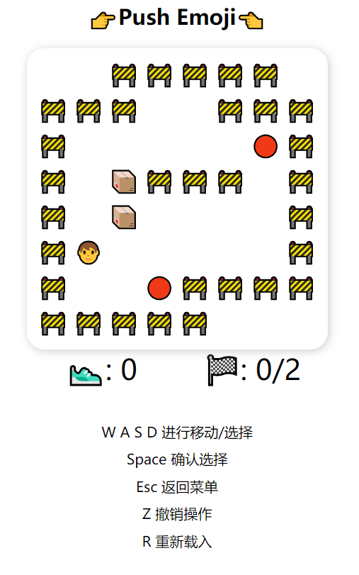

<h1 align="center">👉Push Emoji👈</h1>

一个使用Vue制作的 Emoji 版推箱子游戏。
<a href="https://larendorr.github.io/2019-contest/">Demo</a>

<h2 align="center">特色</h2>

- 关卡、难度选择
- 失败、胜利判断（待改进）
- 支持移动端
- 支持撤销、重新加载

<h2 align="center">游戏截图</h2>

	
	

	
	

	
	

